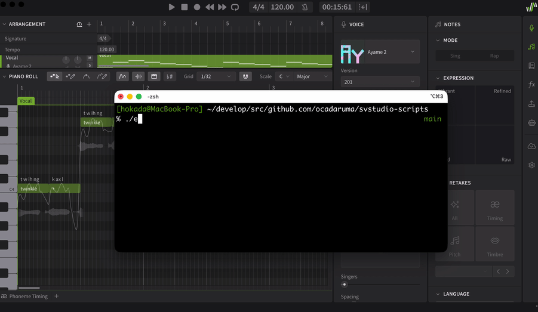

# SVStudio Scripts

Synthesizer V Studio scripts, CLI tools, and AI agent skills.

## EvalServer

A file-based RPC eval server that lets you execute arbitrary Lua code inside Synthesizer V Studio from external processes.



This allows you the AI-centric workflow for SV Studio.

You can let AI agents to write adhoc script and eval it instantly on SV Studio by `eval-client.mjs` to perform any operation.

### Architecture

```
┌──────────────────────┐         ┌──────────────────────┐
│   eval-client.mjs    │         │  StartEvalServer.lua │
│   (Node.js CLI)      │         │  (runs in SVStudio)  │
│                      │         │                      │
│  write command file  │────────▶│  poll command file   │
│                      │         │  eval Lua code       │
│  read response file  │◀────────│  write response file │
└──────────────────────┘         └──────────────────────┘
         │                                │
         ▼                                ▼
  /tmp/svstudio-eval-command.json   /tmp/svstudio-eval-response.json
```

### Setup

1. Open Synthesizer V Studio
2. Run `sv-scripts/StartEvalServer.lua` as a script
3. The server is now running and polling for commands

### Usage

```bash
# Evaluate a single expression
node eval-client.mjs "SV:getProject():getName()"

# Evaluate code from a file
node eval-client.mjs -f my-script.lua

# Read from stdin
echo 'SV:getProject():getName()' | node eval-client.mjs --stdin

# Ping the server
node eval-client.mjs --ping

# Get server status
node eval-client.mjs --status
```

### Stopping

Run `sv-scripts/StopEvalServer.lua` inside Synthesizer V Studio.

### Protocol

**Command file** (`/tmp/svstudio-eval-command.json`):
```json
{
  "requestId": "req_1234567890_1",
  "action": "eval",
  "code": "SV:getProject():getName()"
}
```

**Response file** (`/tmp/svstudio-eval-response.json`):
```json
{
  "requestId": "req_1234567890_1",
  "success": true,
  "result": "My Project"
}
```

**Actions:**
- `eval` — Evaluate Lua code (requires `code` field)
- `ping` — Health check
- `get_status` — Get server state and host info

### Environment Variables

| Variable | Default | Description |
|----------|---------|-------------|
| `COMMAND_FILE` | `/tmp/svstudio-eval-command.json` | Path to command file |
| `RESPONSE_FILE` | `/tmp/svstudio-eval-response.json` | Path to response file |
| `TIMEOUT` | `10000` | Response timeout in ms |

### Evaluated Code Environment

The eval sandbox exposes:
- `SV` — The Synthesizer V Studio API host object
- Standard Lua libraries: `table`, `string`, `math`, `io` (read-only), `os` (limited)
- `json` — JSON parse/stringify helper
- Standard Lua globals: `print`, `tostring`, `type`, `pairs`, etc.

## AI Agent Skills

The `skills/` directory contains AI agent skills for controlling SV Studio.

| Skill | Description |
|-------|-------------|
| `skills/sv-studio/` | Full SV Studio control via eval-client.mjs |

## SV Studio API Reference

Refer to the [official Synthesizer V Studio scripting documentation](https://dreamtonics.com/en/synthesizerv/studio/scripting/).

Crawled API docs are available under `skills/sv-studio/references/` for AI agent use.
